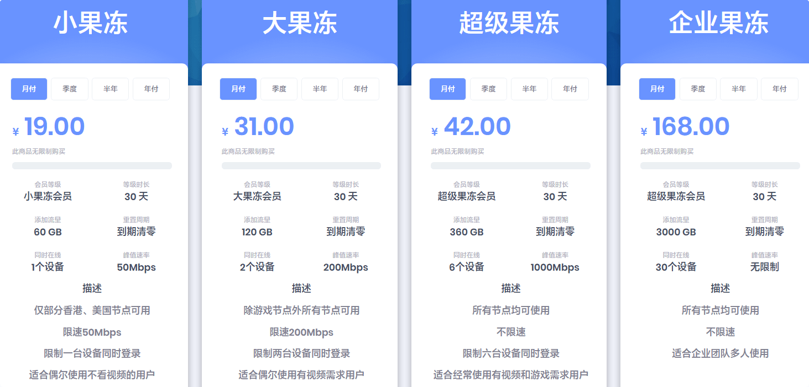

# cloudcave云洞官网发布页

永久官网：[cavecn.com](https://0425.cave02-o66bjll5.top/auth/register?code=m2yA)

直连地址1：[https://yundong.pro](https://0425.cave02-o66bjll5.top/auth/register?code=m2yA)

[](https://0425.cave02-o66bjll5.top/auth/register?code=m2yA)

## 云洞加速简介

CloudCave(云洞)是全隧道专线加速，从2018年开始已经稳定运营多年，节点持续不断更新，用户体验不错，无视任何晚高峰、会议，依然4k流畅。套餐价格实惠，性价比不错。 

### CloudCave特点

```
高速稳定 - 隧道专线混合技术，速度稳定
兼容性好 - 云洞加速服务适用于所有主流平台
方便易用 - 拥有专用的一键客户端，简单易懂不管是新手还是小白，轻松使用
性价比高 - 相比自托管服务可节省大量费用
分布广泛 - CloudCave拥有超过20个国家和地区的节点
```

## CloudCave套餐价格

优惠前低至￥19/月，每月60G流量。 

[](https://0425.cave02-o66bjll5.top/auth/register?code=m2yA)

[订阅 CloudCave(云洞)](https://0425.cave02-o66bjll5.top/auth/register?code=m2yA)
